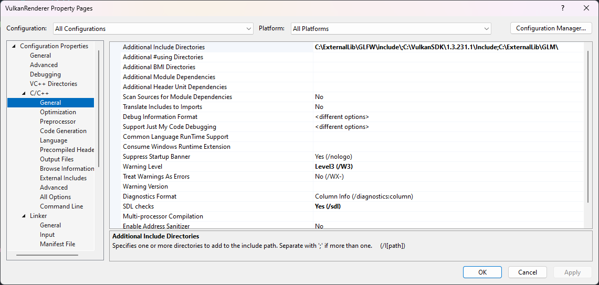
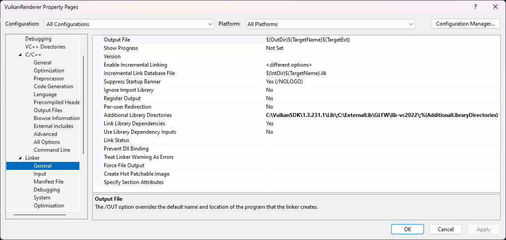
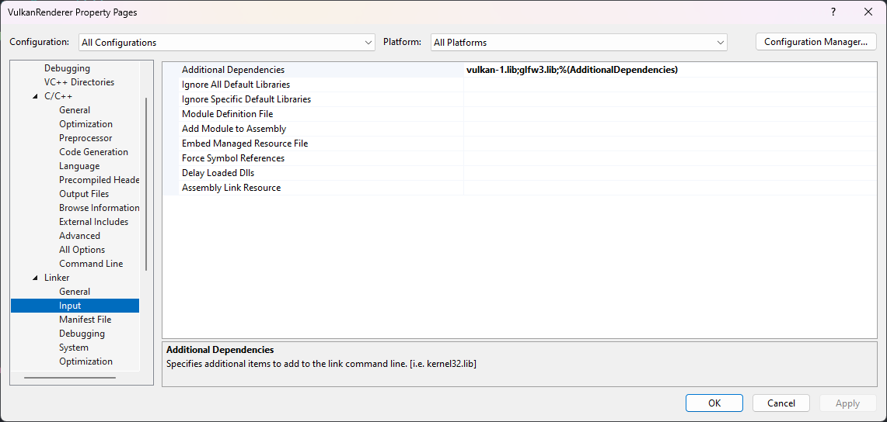

<br><br/>

# Setting up Vulkan.

This tutorial will assume you can set up your own development environment, as my main development platform is Windows
I will be using Visual Studio 2022 for these projects.

## Requirements

- [LunarG SDK development kit](https://www.lunarg.com/vulkan-sdk/)
- [Clang/GCC/MSVC](https://visualstudio.microsoft.com)
- [GLFW](https://www.glfw.org/download.html)
- [GLM](https://github.com/g-truc/glm)
- Knowledge of C++

::: tip
Be sure to put GLFW, GLM and LunarG somewhere central on your system, as most projects will refer to these directories on your system
:::

## Testing Vulkan

Make an empty C++ project and link to the correct libs and header files, exmaple can be seen down below


<br><br/>

<br><br/>


By running this code we can test if the program compiles correctly.

```cpp
// Tell glfw to include Vulkan support
#define GLFW_INCLUDE_VULKAN
#include <GLFW/glfw3.h>

#define GLM_FORCE_RADIANS
// Redefine buffer depth
#define GLM_FORCE_DEPTH_ZERO_TO_ONE
#include <glm/vec4.hpp>
#include <glm/mat4x4.hpp>

#include <iostream>

int main() {
    glfwInit();

    // Tell GLFW that we are using no API (otherwise it will use GDI)
    glfwWindowHint(GLFW_CLIENT_API, GLFW_NO_API);
    GLFWwindow* window = glfwCreateWindow(800, 600, "Vulkan window", nullptr, nullptr);

    // Request the amount of extensions found
    uint32_t extensionCount = 0;
    vkEnumerateInstanceExtensionProperties(nullptr, &extensionCount, nullptr);

    std::cout << extensionCount << " extensions supported\n";

    // GLM tests
    glm::mat4 matrix;
    glm::vec4 vec;
    auto test = matrix * vec;

    while(!glfwWindowShouldClose(window)) {
        glfwPollEvents();
    }

    glfwDestroyWindow(window);

    glfwTerminate();

    return 0;
}
```
